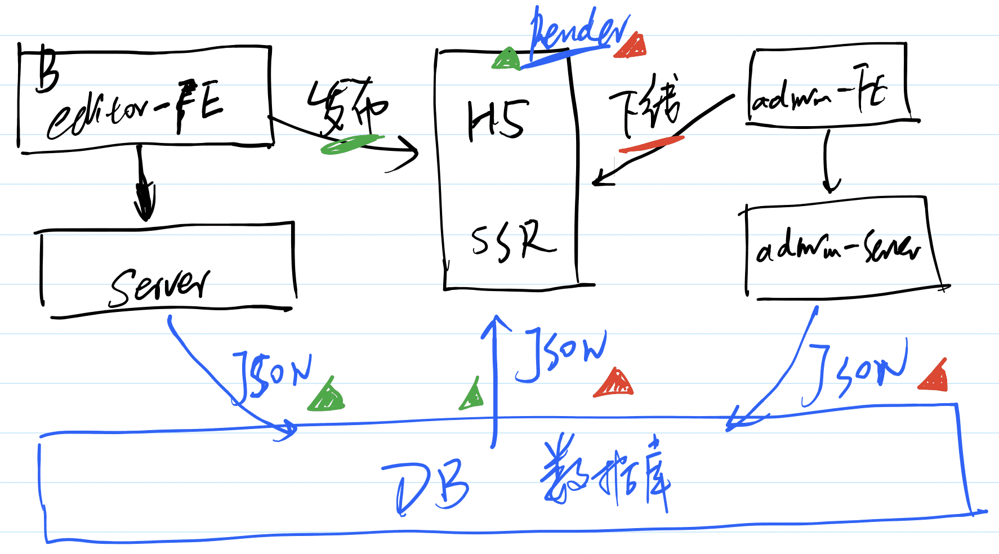

#架构设计

##需求

##模块设计

###作品管理

####前端

注册、登录，我的作品，查看统计数据（作品总pv、分渠道pv），编辑作品

使用模板创建作品

####后端

登录验证，作品API，渠道API，用户管理API，模板API，预览/发布

###作品H5页面

SSR渲染页面，微信分享，事件/动画，分渠道统计

###后台管理

####前端

管理员登录，紧急下线作品，公开模板，设置模板HOT，Dashboard，封禁用户

隐藏模板，设置模板NEW

####后端

用户管理API，作品管理API，模板管理API

###业务组件库

文本，图片，图形，Final-page

###统计服务

收集统计日志，定时计算pv，Open API

##作品的数据结构

vuex + vnode数据结构

###数据流转

核心：B端、C端、管理后台，共用一个数据库

创建作品：初始化一个JSON数据

保存作品：修改JSON数据

发布作品：修改标记

C端浏览作品：获取JSON数据，SSR渲染页面

屏蔽作品：修改标记，C端来判断

C端缓存数据，防止频繁访问数据库

##开发提效

###组件平台

创建组件，发布组件，展示组件

###脚手架

####创建项目

标准模板创建，自定义规则创建，创建组件库，自动安装和启动

####发布项目

Git自动还，云构建，项目自动发布，组件自动发布

##运维保障

线上服务和运维服务

安全

监控和报警

服务扩展性：流量大
